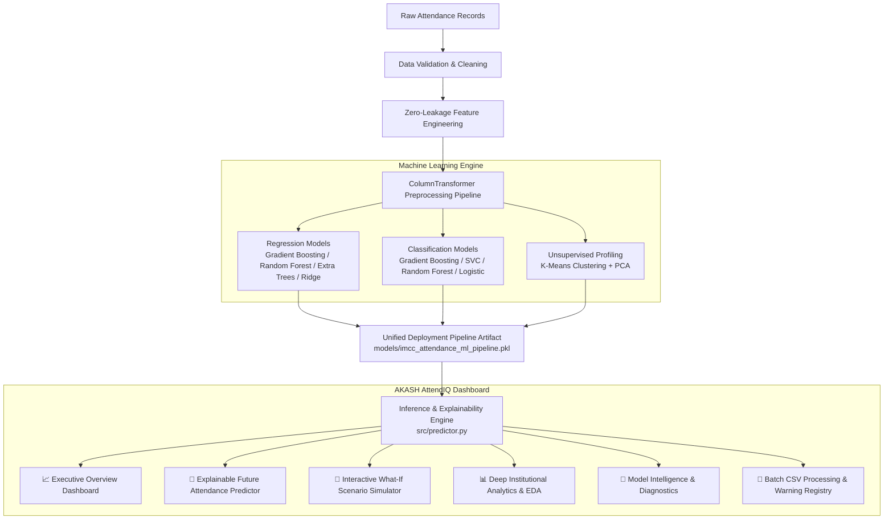

# 🎓 AKASH AttendIQ

### **AI-Powered College Attendance Prediction, Risk Intelligence & Analytics**

[](https://www.python.org/)
[](https://streamlit.io/)
[](https://scikit-learn.org/)
[](https://plotly.com/)
[](https://pytest.org/)
[](LICENSE)

An enterprise-grade, dual-engine Machine Learning platform designed to **forecast future classroom attendance**, **identify at-risk student turnout**, **simulate operational scenarios**, and **deliver deep institutional analytics** for colleges and academic departments.

---

## 📌 Executive Overview & Problem Statement

Classroom attendance in higher education directly influences student academic performance, course completion rates, and regulatory compliance (such as the mandatory **75% university attendance requirement**).

However, attendance is volatile and influenced by multiple complex operational factors:
* **Slot Fatigue & Circadian Rhythm**: Sharp drop-offs in early morning (9:00 AM) and post-lunch (3:00 PM) sessions.
* **Academic Stressors**: Attendance dips or spikes during **Internal Test Weeks** and **Assignment Submission Deadlines**.
* **Holiday Proximity**: Proxy absenteeism compounding around long weekends and institutional holidays.
* **Inertia & Momentum**: Recent 3-lecture and 7-lecture moving averages.

**AKASH AttendIQ** bridges the gap between historical attendance logs and proactive institutional intervention, enabling faculty and department chairs to forecast attendance before lectures occur.

---

## 🏗️ System Architecture



---

## ⚙️ Feature Engineering & Zero-Leakage Protocol

To ensure 100% genuine generalization and prevent data leakage, all historical lag, rolling moving averages, and cumulative counts strictly utilize shifted $(t-1)$ historical records:

| Feature Name | Type | Description | Formulation / Logic |
| :--- | :--- | :--- | :--- |
| `Day_of_Semester` | Numerical | Progression of semester in calendar days | $\text{Date} - \text{Semester\_Start} + 1$ |
| `Week_Number` | Numerical | Academic week sequence | $\lfloor (\text{Day\_of\_Semester} - 1) / 7 \rfloor + 1$ |
| `Time_of_Day` | Categorical | Session period indicator | `"Morning"` if AM, else `"Afternoon"` |
| `Prev_Lecture_Pct` | Numerical | Attendance % of immediately preceding session | Shifted $(t-1)$ within Branch & Section |
| `Rolling_3_Avg` | Numerical | Short-term momentum moving average | $\frac{1}{3} \sum_{i=1}^3 \text{Attendance}_{t-i}$ |
| `Rolling_7_Avg` | Numerical | Medium-term baseline moving average | $\frac{1}{7} \sum_{i=1}^7 \text{Attendance}_{t-i}$ |
| `Gap_Hours` | Numerical | Inter-lecture time decay (hours) | $(T_t - T_{t-1}) / 3600$ |
| `Consecutive_Lecture_Count`| Numerical | Cumulative lecture position within the day | Cumulative count + 1 |
| `Test_Week` | Binary | Internal test week stress indicator | Boolean flag (0 or 1) |
| `Assignment_Due` | Binary | Assignment deadline indicator | Boolean flag (0 or 1) |
| `Holiday_Near` | Binary | Adjacent holiday proximity indicator | Boolean flag (0 or 1) |

---

## 📊 Real Machine Learning Model Benchmarks

Models are evaluated via a **time-aware chronological 80/20 train/test split** simulating real-world forward prediction.

### 1. Regression Leaderboard (Target: `Attendance_Pct`)

| Algorithm | MAE (%) | RMSE (%) | MAPE (%) | $R^2$ Score | Status |
| :--- | :---: | :---: | :---: | :---: | :---: |
| **Gradient Boosting Regressor** | **6.70%** | **8.96%** | **8.96%** | **0.4660** | 🏆 **Champion** |
| Random Forest Regressor | 6.81% | 9.06% | 9.13% | 0.4535 | Runner-up |
| Extra Trees Regressor | 7.12% | 9.60% | 9.59% | 0.3863 | Evaluated |
| Ridge Regression | 7.46% | 9.80% | 10.06% | 0.3617 | Baseline |

### 2. Classification Leaderboard (Target: `Attendance_Risk`)

Three risk tiers: **CRITICAL (<50%)**, **WARNING (50–75%)**, **SAFE (>75%)**.

| Classifier | Accuracy (%) | Precision | Recall | F1-Score | ROC-AUC | Status |
| :--- | :---: | :---: | :---: | :---: | :---: | :---: |
| **Gradient Boosting Classifier** | **78.89%** | **0.7778** | **0.7889** | **0.7769** | **0.8533** | 🏆 **Champion** |
| Support Vector Machine (SVC) | 78.06% | 0.7727 | 0.7806 | 0.7761 | 0.8517 | Runner-up |
| Extra Trees Classifier | 78.89% | 0.7656 | 0.7889 | 0.7735 | 0.8466 | Evaluated |
| Random Forest Classifier | 78.47% | 0.7589 | 0.7847 | 0.7671 | 0.8523 | Evaluated |
| Logistic Regression | 65.00% | 0.7212 | 0.6500 | 0.6667 | 0.7813 | Baseline |

---

## 🔍 Model Explainability & Interpretability

**AKASH AttendIQ** answers four critical operational questions for every prediction:

```text
┌────────────────────────────────────────────────────────────────────────┐
│ WHAT?        Expected Attendance: 82.4% (Estimated Range: 78.2% – 86.5%)│
│ RISK?        SAFE (Confidence: 78.2%)                                  │
│ BASED ON?    Previous lecture (85%), 3-lecture moving avg, Slot timing │
│ WHY?         Top Positives: Recent 3-lecture moving avg (+4.8%)        │
│              Top Negatives: Early morning timing (-2.4%)               │
│ ACTION?      Cohort engagement is optimal. Proceed with roadmap.       │
└────────────────────────────────────────────────────────────────────────┘
```

---

## 🖥️ Streamlit Web Application Pages

1. **📈 Executive Dashboard**: Institutional attendance averages, semester trends, and risk distribution.
2. **🔮 Attendance Predictor**: Single-lecture forecasting with interactive Plotly Gauge and Headcount Donut charts.
3. **🧪 What-If Simulator**: Interactive sensitivity matrix comparing Baseline vs Scenario forecasts with exact percentage delta.
4. **📊 Deep Analytics & EDA**: 8 comprehensive analytical charts (day-of-week patterns, slot fatigue curve, subject rankings, test week boxplots, correlation heatmap).
5. **🤖 Model Intelligence**: Algorithm leaderboards, confusion matrices, and global feature importance.
6. **📁 Batch Processing & Alerts**: Bulk CSV prediction with downloadable template and exportable CSV reports.

---

## 📁 Repository Directory Structure

```
AKASH-AttendIQ/
├── app.py                     # Ultra-modern Streamlit web application
├── train.py                   # Standalone CLI training and benchmarking script
├── requirements.txt           # Production dependencies
├── runtime.txt                # Streamlit Community Cloud runtime config
├── README.md                  # Comprehensive platform documentation
├── .gitignore                 # Git ignore patterns
│
├── data/
│   ├── attendance.csv         # Raw attendance dataset (3,600 records)
│   └── cleaned_attendance.csv # Cleaned & feature-engineered dataset
│
├── models/
│   └── imcc_attendance_ml_pipeline.pkl # Unified serialized model package
│
├── src/
│   ├── __init__.py            # Package initializer
│   ├── config.py              # Configuration constants & theme tokens
│   ├── data_processor.py      # Cleaning, IQR outlier capping & lag features
│   ├── model_trainer.py       # Multi-model benchmarking & hyperparameter tuning
│   ├── predictor.py           # Inference engine & What-If simulator
│   ├── evaluation.py          # Metric calculators & cross-validation
│   └── explainability.py      # Feature attribution & uncertainty estimation
│
├── notebooks/
│   └── EDA.ipynb              # Exploratory Data Analysis Jupyter Notebook
│
└── tests/
    ├── __init__.py
    ├── test_data.py           # Data processing unit tests
    ├── test_model.py          # Model pipeline unit tests
    ├── test_predictor.py      # Prediction & explainability unit tests
    └── test_batch.py          # Batch CSV processing unit tests
```

---

## 🚀 Quickstart Guide

### 1. Installation & Environment Setup

```bash
# Clone the repository
git clone https://github.com/your-username/AKASH-AttendIQ.git
cd AKASH-AttendIQ

# Create a virtual environment
python -m venv venv
source venv/bin/activate  # On Windows: venv\Scripts\activate

# Install required dependencies
pip install -r requirements.txt
```

### 2. Run Automated Test Suite

```bash
pytest
```

### 3. Train & Benchmark ML Models

```bash
python train.py
```

### 4. Launch the Web Application

```bash
streamlit run app.py
```

Open your browser at `http://localhost:8501`.

---

## ☁️ Deployment Instructions

### GitHub Repository Setup

```bash
git init
git add .
git commit -m "feat: complete AKASH AttendIQ platform with explainable ML pipeline and Streamlit dashboard"
git branch -M main
git remote add origin https://github.com/your-username/AKASH-AttendIQ.git
git push -u origin main
```

### Streamlit Community Cloud Deployment

1. Go to [share.streamlit.io](https://share.streamlit.io/).
2. Select your repository `your-username/AKASH-AttendIQ`.
3. Set **Main file path** to `app.py`.
4. Deploy!

---

## 📄 License

This project is licensed under the MIT License — see the [LICENSE](LICENSE) file for details.

**Author**: Machine Learning Engineering Team  
**Product**: AKASH AttendIQ v2.5.0
